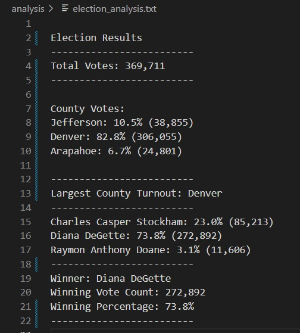

# Election_Analysis

## Overview of Election Audit
The Colorado Board of Elections has requested the following to help complete an election audit of a recent local congressional election:
  1.	Calculate the total number of votes cast.
  2.	The voter turnout for each county
  3.	The percentage of votes from each county out of the total count
  4.	The county with the highest turnout
  5.	Get a complete list of candidates who received votes.
  6.	Calculate the total number of votes each candidate received.
  7.	Calculate the percentage of votes each candidate won.
  8.	Determine the winner of the election based on the popular vote.

## Resources
  -	Data Source: election_results.csv
  -	Software: Python 3.7.6, Visual Studio Code, 1.72

## Election-Audit Results: 
The analysis of the election shows that:
  -	There was a total of 369,711 votes cast in the election.
  -	Voter turnout for each county:
      - Jefferson received 10.5% of the vote, with 38,855 votes.
      - Denver received 82.8% of the vote, with 306,055 votes.
      - Arapahoe received 6.7% of the vote, with 24,801 votes.
  -	 The county with the largest voter turnout was:
      - Denver with 82.8% of the vote, with a count of 306,055 votes
  -	The candidates were:
      - Charles Casper Stockham
      -	Diana DeGette
      -	Raymon Anthony Doane
  -	The candidate results were:
      -	Charles Casper Stockham received 23.0% of the vote, with 85,213 votes.
      -	Diana DeGette received 73.8% of the vote, with 272,892 votes.
      -	Raymon Anthony Doane received 3.1% of the vote, with 11,606 votes.
  -	The winner of the election was:
      -	Diana DeGette, who received 73.8% of the vote with a count of 272,892 votes.

 Below is a screenshot of the election analysis txt file
 

## Election-Audit Summary
The python script used for this audit successfully formulated the analysis results ordered by the election commission.
This script was programmed to be mutable so that it would allow modifications to be made.  This is possible because the python code is not hardcoded to any specific candidate name or county.  Thus, those variables used in this script have no associated value until assigned.  This only happens when the script’s instructions read, iterate, and pull the needed data from a provided CSV file.  Highlighting this illustrates how this script can be used in other elections.
The following are possible script modifications that can be used:
  -	Example 1: The “file_to _load” variable can easily be given a new path to a different CSV file if another election collects data in the same CSV format used in this election.
  -	Example 2: The “file_to_save” variable can also be assigned to a new text file to record the results.
Here is a screenshot of the location where these modifications can be made:

Further modifications are possible with this script and can be done under the guidance or in the hands of a properly trained programmer specializing in Data Analytics.  For further consultation with specific requests or questions, please reach out to our team or me, as we will be pleased to be of service to your business needs.
